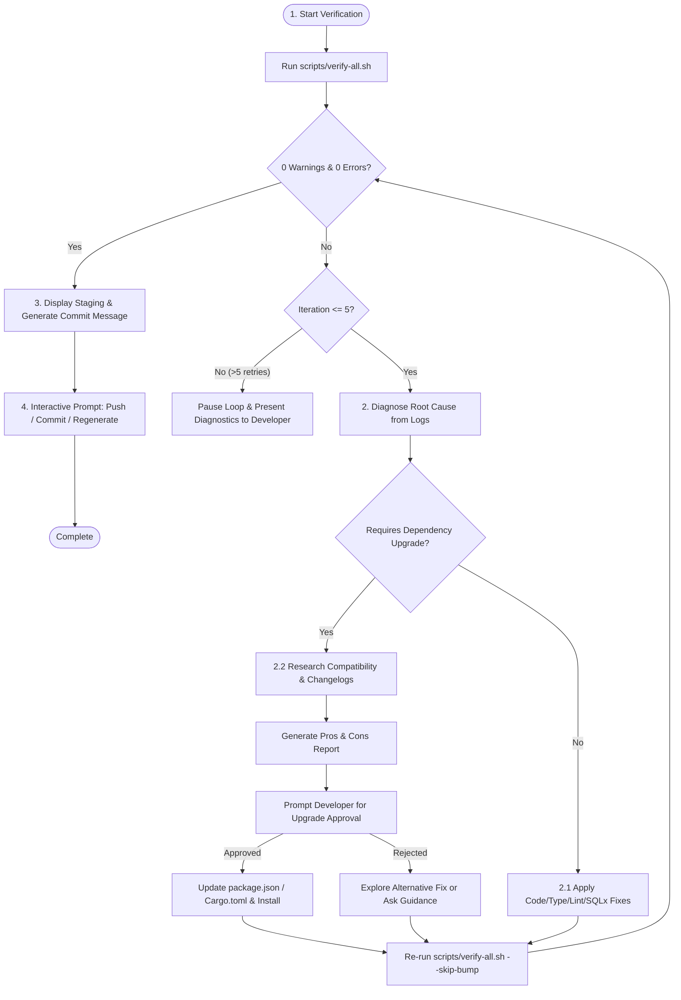

# 🧪 Verify and Commit Workflow

This workflow enforces rigorous code quality standards, mandates **zero build/lint warnings and zero errors** across all monorepo services (`client`, `admin`, `api`), manages an autonomous auto-fix loop with dependency upgrade research protocols, and safely guides the git commit and push process.

---

## 🔄 Workflow Execution Steps



---

### Step 1: Initial Full Stack Verification
1. Run the workspace verification script:
   ```bash
   bash scripts/verify-all.sh
   ```
2. **Semantic Versioning Auto-Bump**:
   - `scripts/verify-all.sh` invokes `scripts/increment-versions.ts` prior to building.
   - Evaluates changes in `client/`, `admin/`, and `api/` and proposes appropriate bumps (`PATCH`, `MINOR`, `MAJOR`).
   - If already bumped in the current development cycle, it is safely skipped.
3. **Strict Zero Warnings & Zero Errors Standard**:
   - Next.js Client: `bun run lint --max-warnings 0` & `bun run build`.
   - React Admin: `bun run lint -- --max-warnings 0` & `bun run build`.
   - Rust Axum API: `cargo fmt -- --check`, `cargo sqlx prepare`, `cargo clippy -D warnings`, `cargo test --lib`.

---

### Step 2: Autonomous Verification & Auto-Fix Loop
If any step in `scripts/verify-all.sh` fails or emits warnings/errors:
**DO NOT commit or push.** The agent enters an autonomous fix loop.

#### 2.1 Autonomous Diagnostics & Code Fixes
1. Read the command output and error logs to identify the failing service and step:
   - **ESLint / Style Warnings**: Fix unused variables, missing hook dependencies, unescaped entities, or accessibility attributes.
   - **TypeScript / Build Errors**: Fix type mismatches, missing props, incorrect imports, or invalid App Router configurations.
   - **Rust Clippy Warnings**: Resolve Clippy suggestions, dead code, redundant clones, or pattern matching lints.
   - **SQLx Preparation**: Re-run `cargo sqlx prepare` if query macros changed.
   - **Unit Tests**: Correct broken assertions or business logic regressions.
2. Apply the targeted code modifications.
3. Re-run verification using `bash scripts/verify-all.sh --skip-bump` to test the fixes without re-triggering redundant version bumps.

#### 2.2 Mandatory Dependency Upgrade Protocol
When a fix indicates that a package upgrade or addition is necessary (e.g., peer dependency conflict, broken upstream typing, deprecation, known library bug, or security advisory):

1. **Mandatory Compatibility Research First**:
   - Query the `context7` MCP server (`resolve-library-id` -> `query-docs`) and/or search online documentation, GitHub releases, and changelogs.
   - Investigate breaking changes, migration requirements, and compatibility with the monorepo core stack:
     - React 19 / Next.js App Router
     - Tailwind CSS v4 / Vite
     - Axum / SQLx / Tokio
     - Bun package manager
2. **Compile & Present Pros & Cons Report**:
   - Present a clear, structured summary to the user before editing manifests:

   > ### 📦 Dependency Upgrade Proposal: `<package-name>`
   > - **Current Version**: `x.y.z`
   > - **Target Version**: `a.b.c`
   > - **Reason**: `<Explain why this upgrade solves the build/lint/runtime issue>`
   > 
   > | Aspect | Details |
   > | :--- | :--- |
   > | **Pros** | • Resolves `<specific error/warning>`<br>• Improved type safety / performance<br>• Access to `<new feature/fix>` |
   > | **Cons / Risks** | • Potential breaking changes in `<API>`<br>• Requires updating `<related config/component>` |
   > | **Compatibility** | • Verified compatible with React 19 / Next.js / Axum<br>• No peer dependency conflicts found |
   > | **Mitigation** | • `<Step-by-step mitigation or verification plan>` |

3. **Request User Confirmation**:
   - Prompt the user (via `ask_question` or interactive chat) to confirm the upgrade before updating `package.json` or `Cargo.toml`.
   - Once approved, install dependencies (`bun install` or `cargo check`) and proceed with the loop.

#### 2.3 5-Iteration Safety Guardrail
- Maintain an internal counter for fix attempts during the loop.
- **Maximum 5 autonomous iterations**.
- If errors or warnings persist after 5 iterations:
  - **Pause the loop immediately**.
  - Surface a comprehensive summary to the developer:
    1. Exact remaining error/warning logs.
    2. List of root causes analyzed and fixes attempted.
    3. Potential solutions or architectural questions for developer guidance.

---

### Step 3: Generate Conventional Commit
Once `scripts/verify-all.sh` passes completely with **0 warnings and 0 errors**:

1. Inspect modified and staged files:
   ```bash
   git status --short
   ```
2. Display the staged changes summary to the developer.
3. Formulate a high-quality commit message following **Conventional Commits**:
   - Format: `<type>(<scope>): <imperative description>`
   - Types: `feat`, `fix`, `refactor`, `perf`, `test`, `docs`, `chore`
   - Subject line must be imperative and concise (maximum 50 characters).
   - Include a descriptive body if non-trivial architectural changes or dependency upgrades occurred.

---

### Step 4: Execute Git Operations
1. Present the verification success banner and proposed commit message to the user.
2. Prompt the user with an interactive selector:
   - **1. Commit and push** (`git commit -m "..." && git push`)
   - **2. Commit only** (`git commit -m "..."`)
   - **3. Regenerate commit message** (Re-analyze diff and propose alternatives)
3. Execute the selected operation accordingly.
