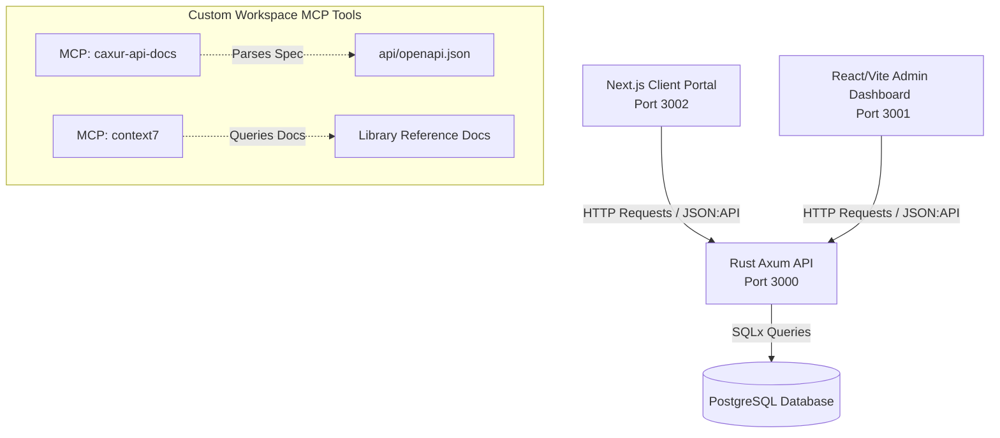

# 🤖 Caxur-FS AI Agent Developer Guide

Welcome to the **Caxur Full-Stack Monorepo (`caxur-fs`)**! This guide is designed to onboard and govern AI Agents, Assistants, and Pair-Programmers working in this repository. It details our architecture, strict coding standards, workflows, custom tools, and workspace-level MCP servers to ensure highly-polished, premium, and correct contributions.

---

## 🏗️ Monorepo Architecture Overview

The `caxur-fs` repository houses a robust, high-performance web application consisting of three primary services interacting with a PostgreSQL database:

### Services Summary:
1. **`client` (Next.js, Port 3002)**: The public-facing client portal built with Tailwind CSS v4, Shadcn UI, and Server-First principles.
2. **`admin` (React + Vite, Port 3001)**: The back-office administrative panel utilizing Zustand, React Query, Tailwind CSS v4, and Shadcn UI.
3. **`api` (Rust + Axum, Port 3000)**: The core backend service adhering to Clean Architecture, Domain-Driven Design (DDD), and JSON:API compliance.

---

## 🗃️ Workspace Agent Resources

All files related to AI Agent management, guidance, and tools are located in the `.agents/` directory:

- **`.agents/rules/`**: Target-specific system rules triggered by file patterns.
  - [`nextjs-client.md`](.agents/rules/nextjs-client.md): Rules for the Next.js frontend client.
  - [`react-admin.md`](.agents/rules/react-admin.md): Rules for the Vite React admin dashboard.
  - [`rust-axum-api.md`](.agents/rules/rust-axum-api.md): Rules for the Rust Axum API.
- **`.agents/skills/`**: Rigid instructions and patterns for development.
  - `nextjs-client/SKILL.md`: Design system, form rules, and server boundaries.
  - `react-admin/SKILL.md`: Zustand stores, caching with React Query, and views.
  - `rust-axum-api/SKILL.md`: Layer isolation, Domain mapping, database models, and error formatting.
- **`.agents/workflows/`**: Step-by-step guidelines for automated tasks.
  - [`setup-project.md`](.agents/workflows/setup-project.md): Initial bootstrapping workflow.
  - [`run-dev.md`](.agents/workflows/run-dev.md): Development environment launch sequence.
  - [`verify-commit.md`](.agents/workflows/verify-commit.md): Pre-commit verification and git push sequence.
  - [`bhu.md`](.agents/workflows/bhu.md): Agent task creation, skill planning, and sub-agent allocation workflow.
- **`.agents/plugins/`**: Custom workspace plugins exposing Model Context Protocol (MCP) servers.

---

## ⚙️ Custom Workspace MCP Tools & Plugins

To maximize efficiency and eliminate guessing, AI agents must leverage the two custom MCP servers registered in the workspace:

### 🔌 1. `caxur-api-docs` MCP Server
- **Configuration**: [mcp_config.json](.agents/plugins/caxur-api-docs/mcp_config.json) (runs `scripts/mcp-api-docs.ts` via Bun)
- **Active Skill**: [api-docs-query SKILL.md](.agents/plugins/caxur-api-docs/skills/api-docs-query/SKILL.md)
- **Available Tools**:
  - `list_endpoints`: Returns all routes grouped by tags (Auth, Users, Roles, etc.).
  - `search_endpoints`: Performs keyword searches on endpoints (e.g., `query: "roles"`).
  - `get_endpoint_details`: Returns dereferenced schemas, parameters, responses, and security requirements.
  - `generate_typescript_types`: Generates complete, type-safe API helper functions and fetch interfaces.

> [!TIP]
> **Data Integration Flow**: When building pages in `client` or `admin`, **never hand-write types or routes**. Always run `search_endpoints` -> `get_endpoint_details` -> `generate_typescript_types` to integrate endpoints safely and programmatically.

### 📚 2. `context7` MCP Server
- **Active Skill**: [context7-docs SKILL.md](.agents/plugins/context7/skills/context7-docs/SKILL.md)
- **Available Tools**:
  - `resolve-library-id`: Maps framework or package names to specific identifiers.
  - `query-docs`: Returns targeted, up-to-date documentation on frameworks, APIs, and crates (e.g. Next.js, Axum, SQLx, Tailwind, React 19).

---

## 🔄 AI Agent Workflows

AI agents should recommend these commands to the user, or execute the underlying scripts directly in the terminal:

### ⚙️ 1. `/setup-project` (Bootstrap Environment)
- Runs [scripts/setup.sh](scripts/setup.sh).
- Checks/installs Docker, Bun, Cargo, and SQLx CLI.
- Automatically scaffolds `.env.local` (Client and Admin) and `.env` (API).
- Runs `bun install` to download dependencies.

### 🚀 2. `/run-dev` (Start Stack Concurrently)
- Runs [scripts/run-dev.sh](scripts/run-dev.sh).
- Automatically kills dangling ports (3000, 3001, 3002).
- Starts PostgreSQL container via Docker Compose.
- Executes `concurrently` to run API (`cargo watch`), Client, and Admin (`bun run dev`).
- Access points:
  - **API Service**: `http://localhost:3000`
  - **Admin Dashboard**: `http://localhost:3001`
  - **Client Portal**: `http://localhost:3002`

### 🧪 3. `/verify-commit` (Safe Verification & Commit)
- Runs [scripts/verify-all.sh](scripts/verify-all.sh).
- Verifies Client builds, Admin builds, SQLx preparation, API type checks, and runs OpenAPI specs generation (`cargo test`).
- Analyzes changes and prompts the user with an interactive selector to:
  1. Commit and push (with high-quality Conventional Commit message).
  2. Commit only.
  3. Regenerate commit message.

### 📋 4. `/bhu` (Agent Task Creation & Planning)
- Governed by [`.agents/workflows/bhu.md`](.agents/workflows/bhu.md).
- Enforces rigorous requirement ingestion, custom Model Context Protocol (MCP) server mapping, workspace-specific skill alignment, and sub-agent workload decomposition prior to writing any production code.

---

## 📐 Project Rules & Guardrails

Before modifying code, the agent MUST review the strict boundaries defined for each layer:

### 🛡️ 1. Rust Axum API (`api/`)
* **Layer Isolation**: Keep layers strict:
  $$\text{Domain (Traits, Entities)} \longleftarrow \text{Application (Use Cases)} \longleftarrow \text{Infrastructure (DB Models)} \longleftarrow \text{Presentation (Handlers, DTOs)}$$
  *No database or network-level code is allowed in Domain or Application.*
* **JSON:API v1.1 Compliance**:
  - Success responses must be wrapped in `ApiResponse`.
  - Relations requested via `?include=` MUST be placed in the top-level `included` array. Never inject relationships into primary `attributes`.
  - Pagination is mandatory on all list queries using `page[number]` and `page[size]`.
* **Validation**: Wrap parameters in `ValidatedJson` extractor. Validation errors must trigger a `422 Unprocessable Entity` containing a JSON:API compliant error mapping the exact path with `source.pointer`.
* **Rate Limiting**: Apply corresponding middleware per endpoint:
  - **Auth/Strict**: `auth_rate_limit_layer` (default: 10/min).
  - **Public/Guest**: `public_rate_limit_layer` (default: 60/min).
  - **Private/Standard**: `api_rate_limit_layer` (default: 300/min).
* **Testing**: Only write **Unit Tests** for core logic. DO NOT write integration tests.

### 🖥️ 2. Next.js Client Portal (`client/`)
* **Server-First Approach**: Default to React Server Components (RSC). Keep `'use client'` boundaries as low and small as possible.
* **URL Syncing**: **All** filters, paginated tables, search boxes, and active tabs MUST bind state directly to search parameters in the URL (`?page=1&search=term`). Do not store search/filter state in isolated local hooks. Debounce text inputs before pushing.
* **Forms**: Always validate fields using React Hook Form combined with Zod schemas. Explicitly mark optional field labels with `(optional)`.
* **Notifications**: Standardize notifications using `sonner` (`toast.success` / `toast.error`). No native `window.alert` or `window.confirm`.
* **Dates & Times**: Always format dates using the shared `formatDateTime` utility to ensure time visibility.

### 👔 3. React Admin Portal (`admin/`)
* **Feature-Based Structure**: Organize files logically under features (e.g., `features/users/components/`).
* **State Boundaries**: Zustand is strictly reserved for *global client state* (sessions, layout toggles, theme). Use React Query (TanStack Query) exclusively for *server state* (data fetching, mutations, and caching).
* **Forms & Tables**: Strictly sync table pagination/filters to the URL via `useSearchParams`. Use Zod for form contracts.
* **Notifications**: Use `sonner` toasts and Shadcn Dialogs / Alert Dialogs. No native UI confirmations.

---

## 🗑️ Temporary File & Lifecycle Policy

* **Clean Repository Guarantee**: If you create a temporary file, dry-run script, mockup, or test file in this directory to validate your changes, **you MUST delete it immediately** after verification to prevent cluttering the repository.
* **Commit Hook Execution**: Pre-commit verification is strictly checked. The `hooks.json` file triggers pre-tool script checks to ensure the monorepo always compiles clean.

---

*For detailed instructions on implementing design systems or writing domain logic, check the corresponding `SKILL.md` file in `.agents/skills/`.*
