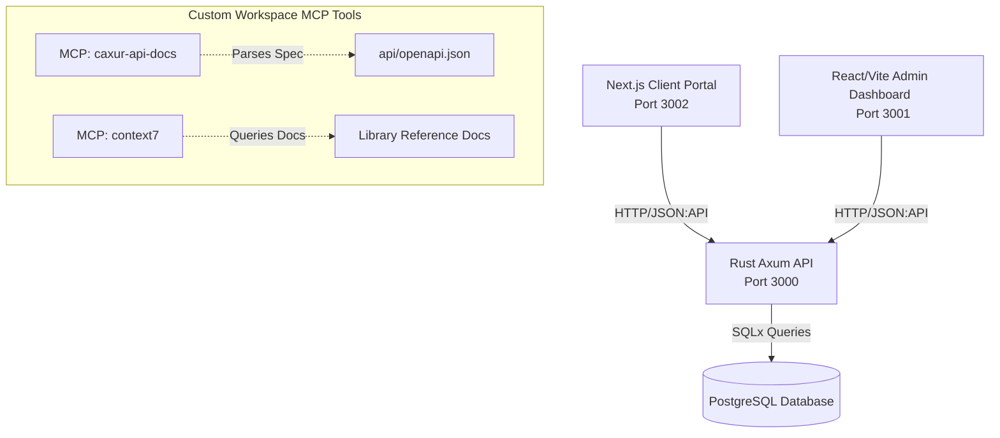

# 🏗️ Caxur Full-Stack Monorepo (`caxur-fs`)

Welcome to the `caxur-fs` project repository! This is a modern, high-performance full-stack monorepo featuring a multi-service architecture tailored for robustness, clean separation of concerns, and an excellent developer experience. 

---

## 🏗️ Architecture & Service Stack

The monorepo coordinates three primary services interacting with a central PostgreSQL database:



### Services Summary:

1. **`client` (Port 3002)**
   - **Framework:** Next.js (App Router, Server-First React Components)
   - **Styling & UI:** Tailwind CSS v4, Shadcn UI
   - **Purpose:** Public-facing customer portal.

2. **`admin` (Port 3001)**
   - **Framework:** React + Vite
   - **State Management & Caching:** Zustand (global UI state), React Query (server-state & caching)
   - **Styling & UI:** Tailwind CSS v4, Shadcn UI
   - **Purpose:** Back-office administrative dashboard.

3. **`api` (Port 3000)**
   - **Framework:** Rust + Axum
   - **Database:** PostgreSQL via SQLx
   - **Design:** Clean Architecture, Domain-Driven Design (DDD), and strict JSON:API compliance.

---

## 🤖 Developer & AI Agent Resources

All governance, architectural contracts, and automated developer aids are contained in the `.agents/` folder. If you are an AI assistant or human developer contributing to this repo, please review the rules and guidelines:

* **🚨 Active Rules (`.agents/rules/`)**: Path-triggered system constraints.
  * [`nextjs-client.md`](.agents/rules/nextjs-client.md) — Next.js and RSC boundaries.
  * [`react-admin.md`](.agents/rules/react-admin.md) — State and cache boundaries.
  * [`rust-axum-api.md`](.agents/rules/rust-axum-api.md) — Rust layer isolation & JSON:API compliance.
* **🧠 Core Skills (`.agents/skills/`)**: Deep-dive architectural instructions.
  * [`nextjs-client/SKILL.md`](.agents/skills/nextjs-client/SKILL.md) — UI styling, forms, and server boundaries.
  * [`react-admin/SKILL.md`](.agents/skills/react-admin/SKILL.md) — Zustand, Query hydration, and view layouts.
  * [`rust-axum-api/SKILL.md`](.agents/skills/rust-axum-api/SKILL.md) — Strict domain isolation, SQLx models, and JSON:API error mapping.
* **🔄 Active Workflows (`.agents/workflows/`)**: Step-by-step developer checklists.
  * [`setup-project.md`](.agents/workflows/setup-project.md) — Bootstrapping the monorepo.
  * [`run-dev.md`](.agents/workflows/run-dev.md) — Local concurrently-driven environment details.
  * [`verify-commit.md`](.agents/workflows/verify-commit.md) — Verification pipeline rules.
  * [`bhu.md`](.agents/workflows/bhu.md) — AI agent task creation & sub-agent planning guidelines.

---

## 🚀 Getting Started

We provide a set of automated scripts in `scripts/` to ensure immediate, zero-friction startup.

### 1. Bootstrap Environment
Installs workspace prerequisites (Bun, Cargo, SQLx CLI, Docker if missing), sets up local environment files (`.env.local` / `.env`), and pulls NPM packages.
```bash
./scripts/setup.sh
```

### 2. Launch Local Dev Stack
Concurrently starts the PostgreSQL container, compiles and hot-reloads the Rust backend (`cargo-watch`), and fires up both frontends (`bun run dev`).
```bash
./scripts/run-dev.sh
```
* **API Service:** `http://localhost:3000`
* **Admin Dashboard:** `http://localhost:3001`
* **Client Portal:** `http://localhost:3002`

### 3. Verify & Safe Commit
Verifies types, builds all packages, compiles cargo binaries, runs test suites, and prompts a clean Conventional Commit wizard.
```bash
./scripts/verify-all.sh
```

---

## 📁 Repository Structure

```text
caxur-fs/
├── .agents/              # AI agent resources, rules, and plugins
│   ├── plugins/          # Custom workspace MCP servers (context7, caxur-api-docs)
│   ├── rules/            # Context-triggered system rules
│   ├── skills/           # Architectural code guides
│   │   ├── nextjs-client/
│   │   ├── react-admin/
│   │   └── rust-axum-api/
│   └── workflows/        # Interactive standard workflow guidelines
├── admin/                # React / Vite Administrative dashboard
│   ├── public/           # Static assets
│   ├── src/
│   │   ├── components/   # UI elements (buttons, inputs, dialogs)
│   │   ├── features/     # Feature-scoped components & hooks (e.g. users, sessions)
│   │   ├── hooks/        # Shared React hooks
│   │   ├── layouts/      # Dashboard shells and shells
│   │   ├── routes/       # Centralized route tree mapping
│   │   ├── store/        # Global UI Zustand stores
│   │   └── types/        # TS contracts and custom interfaces
├── api/                  # Rust Axum Backend
│   ├── migrations/       # DB schema migrations (SQLx)
│   ├── src/
│   │   ├── domain/       # Enterprise entities and traits (dependency-free)
│   │   ├── application/  # Core business use cases
│   │   ├── infrastructure/ # DB connections, SQLx models, outward adapters
│   │   ├── presentation/ # HTTP handlers, routes, request/response DTOs
│   │   ├── shared/       # Cross-cutting utils, error-types & validation
│   │   └── main.rs       # Application entry point & service bootstrap
│   └── openapi.json      # Shared API specification (JSON:API v1.1 compliant)
├── client/               # Next.js App Router Client Portal
│   ├── src/
│   │   ├── app/          # Core pages, layouts, and API proxies
│   │   ├── components/   # High-quality UI components (Tailwind v4 / Shadcn)
│   │   ├── hooks/        # Client hooks and context
│   │   └── lib/          # Utilities and API fetch helpers
├── scripts/              # Monorepo automation scripts
│   ├── setup.sh          # Installs dependencies & registers environments
│   ├── run-dev.sh        # Runs local environment services concurrently
│   ├── verify-all.sh     # Validates compilation, typings, and tests
│   ├── generate_keys.sh  # Bootstraps cryptographic keys (JWT tokens, etc.)
│   └── mcp-api-docs.ts   # Script backing the local OpenAPI parsing tool
├── AGENTS.md             # Standard onboard guide for LLMs & AI engines
└── README.md             # This file
```
